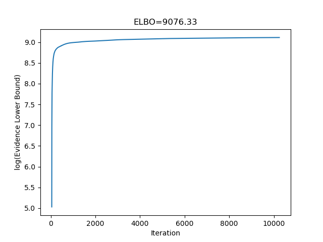
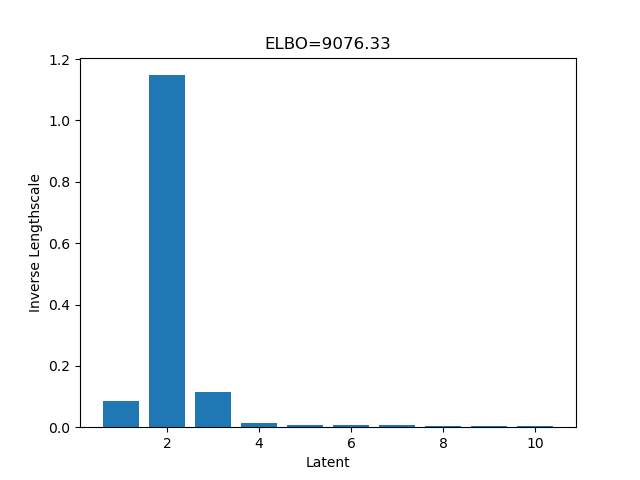
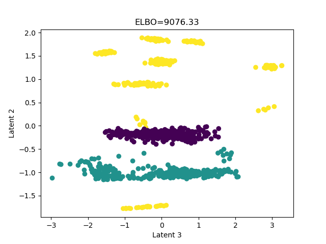

# GPyTorch implementation of Bayesian GP-LVM (Titsias and Lawrence, 2010)

This implementation is a modification of code from the [Bayesian GP-LVM in GPflow](https://gpflow.readthedocs.io/en/master/_modules/gpflow/models/gplvm.html#BayesianGPLVM) using the [psi statistics implemented in GPy](https://gpy.readthedocs.io/en/deploy/GPy.kern.src.psi_comp.html#module-GPy.kern.src.psi_comp.rbf_psi_comp).

An example script running this implementation can be found [here](scripts/doOptimizeBGPLVM.py). Using the Oil Flow dataset, this implementation generates the following figures. Compare them with Figure 1 in Titsias and Lawrence, 2010.

